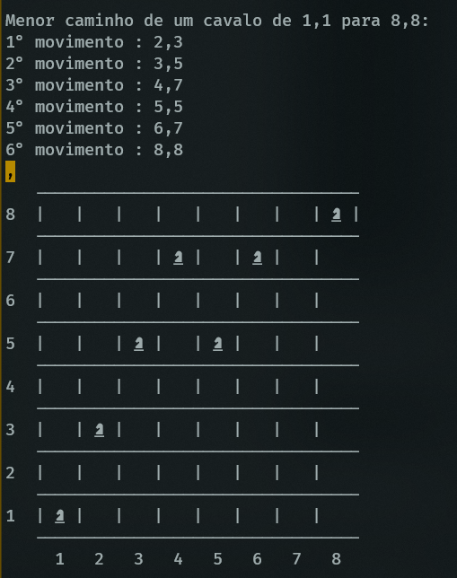

# Knight Moves

Um algoritmo que calcula o menor caminho que um cavalo pode fazer
para ir de uma posição inicial para uma posição final dentro do tabuleiro de xadrez seguindo as regras de movimentação do cavalo

## Funcionalidades

- Calcula o menor caminho entre duas posições no tabuleiro
- Mostra um tabuleiro com os movimentos feitos pelo cavalo

## Como usar

- Clone o repositório :

```bash
git clone https://github.com/jhenriquem/knight-moves.git
```

- Execute o arquivo (certifique-se de ter node.js intalado) :

```bash
node knightMoves.js
```


